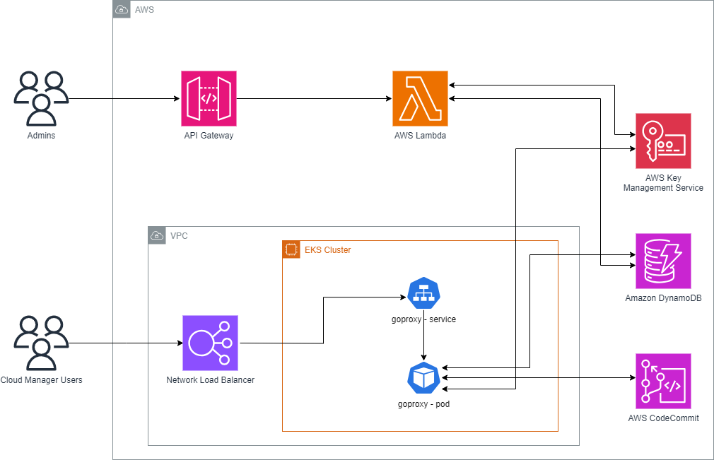

# AWS CodeCommit Personal Access Tokens
AWS CodeCommit is a managed source control service that provides secure, highly scalable private git repositories. One of the advantages of utilizing AWS CodeCommit is its tight integration with existing AWS services including authentication through AWS Identity and Access Management (IAM). Another widely utilized authentication method is long lived Personal Access Tokens (PAT) which is supported by many Git services such as GitHub and GitLab but are not supported in AWS CodeCommit. This repo provides a solution to allow PATs to be utilized for authenticating with AWS CodeCommit.

### Architecture 

1. User performs git operations utilizing a proxied URL with basic auth credential: (username:PAT)
2. Proxied URL points to a reverse proxy running in Amazon EKS. The reverse proxy validates the basic auth credential against valid Personal Access Token (PAT) stored in Amazon DynamoDB.
3. If the PAT is valid, it injects basic auth credentials generated utilizing AWSSigV4.
4. IAM credentials of the call utilize the EKS Pod credentials which are retrieved utilizing IAM roles for service accounts (IRSA).
5. Response is returned to the user.

**Fig. 1**



### Infrastructure Deployment

#### Prerequisites

* NodeJS installed (v14.15.0+)
* AWS Credentials setup in your environment. 

#### Instructions

1. Install cdk. Review [AWS Documentation](https://docs.aws.amazon.com/cdk/v2/guide/getting_started.html) on how to do this.

```
npm install -g aws-cdk
```

2. Bootstrap cdk. Ensure you put your ACCOUNT-NUMBER and REGION (e.g. us-east-1). 

```
cdk bootstrap aws://ACCOUNT-NUMBER/REGION
```

3. Deploy the cdk package.

```
cd cdk
npm install
cdk deploy 
```

4. There are several outputs that you should note:

```
Outputs:
CdkStack.APIGATEWAYURL = <APIGATEWAYURL>
CdkStack.CodeCommitPATEKSClusterName5D204C77 = CodeCommitPATEKS
CdkStack.CodeCommitPATEKSConfigCommandC63DCB0A = aws eks update-kubeconfig --name CodeCommitPATEKS --region <REGION> --role-arn <ROLEARN>
CdkStack.CodeCommitPATEKSGetTokenCommandDBC7402C = aws eks get-token --cluster-name CodeCommitPATEKS --region <REGION> --role-arn <ROLEARN>
CdkStack.CodeCommitPATEKSMastersRoleArnC04CCB0A = <ROLEARN>
CdkStack.BenchmarkInstanceHostname = <BENCHMARKINSTANCEHOST>
CdkStack.ECRRepoURI = <ECRREPOURI>
```

### Build and deploy PAT proxy container image

#### Prerequisites

* ECR Repository URL from CDK output (CdkStack.ECRRepoURI)
* Docker

#### Instructions

1. Retrieve the deployed ECR repository URI from CDK outputs. The PAT proxy container image will be stored in ECR for EKS to access and deploy the container.

```
CdkStack.ECRRepoURI = <ACCTNUM>.dkr.ecr.<REGION>.amazonaws.com/patproxy
```

2. Build the docker image using the provided Dockerfile in the src/ folder.

```
docker build . -t <ACCTID>.dkr.ecr.<REGION>.amazonaws.com/patproxy:latest
```

3. Push the docker image to ECR. You might need to login to ECR in docker.

```
aws ecr get-login-password --region <REGION> | docker login --username AWS --password-stdin <ACCTID>.dkr.ecr.<REGION>.amazonaws.com
docker push <ACCTID>.dkr.ecr.<REGION>.amazonaws.com/patproxy:latest
```

### Deploy to EKS

#### Prerequisites

* EKS Cluster
* kubectl installed and connected to your EKS Cluster

#### Instructions

The manifests included in this prototype rely on 2 Kubernetes controllers: AWS Load Balancer controller and cert-manager. Both are installed with the CDK deployment along with the EKS cluster. 

1. Create and use the context in your EKS cluster by running the commands outputted from the CDK deployment.

```
CdkStack.CodeCommitPATEKSClusterName5D204C77 = CodeCommitPATEKS
CdkStack.CodeCommitPATEKSConfigCommandC63DCB0A = aws eks update-kubeconfig --name CodeCommitPATEKS --region us-east-1 --role-arn arn:aws:iam::<ACCTID>:role/Admin

# Run the command to create the context:
aws eks update-kubeconfig --name CodeCommitPATEKS --region <REGION> --role-arn arn:aws:iam::<ACCTID>:role/Admin

# Use the context:
kubectl config use-context arn:aws:eks:<REGION>:<ACCTID>:cluster/CodeCommitPATEKS
```

2. Modify the provided deployment.yaml manifest with values specific to your environment.

```
      serviceAccountName: iamserviceaccount
      containers:
        - name: patproxy
          image: <ACCTID>.dkr.ecr.<REGION>.amazonaws.com/patproxy:latest
          imagePullPolicy: Always
          env:
          - name: PATTABLENAME
            value: "CodeCommitPATPatTable"
          - name: SSLCERT
            value: "/app/ssl/tls.crt"
          - name: SSLKEY
            value: "/app/ssl/tls.key"
          - name: GITURL
            value: "https://git-codecommit.<REGION>.amazonaws.com/"
```

* serviceAccountName - The CDK included with the prototype will create a service account named “iamserviceaccount” that can be utilized to give the proper IAM permissions to the PAT proxy application running in EKS. The IAM permissions are provided to the Pod using the IAM Roles for Service Accounts (IRSA) paradigm. You can read more about this process [here](https://docs.aws.amazon.com/eks/latest/userguide/iam-roles-for-service-accounts.html)
* image - The location of your ECR image. Should be in the following format if inside ECR: <ACCTID>.dkr.ecr.<REGION>.amazonaws.com
* PATTABLENAME - this is the name of the dynamodb lock table.
* SSLCERT - this is the SSL certificate for the HTTPs Reverse Proxy server.
* SSLKEY - this is the SSL key for the HTTPs Reverse Proxy server.
* GITURL - this is the URL of CodeCommit that will be proxied.

3. After you have made the appropriate modifications, apply all the manifests in this order:

```
kubectl apply -f ./manifests/cert.yaml
kubectl apply -f ./manifests/deployment.yaml
kubectl apply -f ./manifests/service.yaml
```

### Updating PAT Proxy Image

#### Instructions

1. If you make any changes to the PAT proxy source code, perform the same steps from earlier to build and push the updated the image to ECR.

2. Ensure the deployment manifest uses the updated image. If you use the latest tag, you will also need to rescale your deployment:

```
kubectl scale --replicas=0 deployments patproxy -n patproxy
kubectl scale --replicas=1 deployments patproxy -n patproxy
```

3. If you push using a different version name, change the image to the new version.

```
kubectl set image deployment/patproxy patproxy=<ACCTID>.dkr.ecr.<REGION>.amazonaws.com/patproxy:<VERSION>
```

## Path to Production

As this solution is a security related, a PenTest should be conducted before being placed in Production. 

## Teardown

1. Destroy the CDK stack:
```
cd cdk
cdk destroy
```


## API Reference

**GenerateToken**

* Input: repoID, username, expiration
* Output: PAT
* Method: POST
* Sample Body:

```
{
   "repoid": "Test2",
   "username": "user",
   "expiration": "7/26/2023"
}
```

* Sample Output:

```
{
  token: "35343139363532632d663363392d346163612d623361392d636131616134313063343434"
}
```

**ListTokensByRepoID**

* Input: repoID, username(optional)
* Output: all PATs by repoID and/or username
* Method: POST
* Sample Body:

```
{
   "repoid": "Test2",
   "username": "user"
}
```

* Sample Output:

```
{"Items":[{"expiration":{"N":"1692057600"},"username":{"S":"user"},"token":{"S":"35343139363532632d663363392d346163612d623361392d636131616134313063343434"},"repoID":{"S":"Test2"}}]}
```

**DeleteToken**

* Input: token
* Output: none
* Method: POST
* Sample Body:

```
{
   "token": "35343139363532632d663363392d346163612d623361392d636131616134313063343434"
}
```

* Sample Response:

```
{ success: 1 }
```

## CLI Reference

Note: The API Gateway URL will be given after the deployment of the CDK stack.

```
# GenerateToken command:
node .\index.js generatetoken \
--apiurl https://<APIGATEWAYURL> \
--repoid <REPOID> \
--username <USERNAME> \
--expiration <EXPIRATIONDATE (i.e 8/23/2023)>

# ListTokensByRepoID command:
node .\index.js listtokensbyrepoid \
 --apiurl https://<APIGATEWAYURL> \
 --repoid <REPOID>

# DeleteToken command:
node .\index.js deletetoken \
--apiurl https://<APIGATEWAYURL> \
--token <PATTODELETE>
```